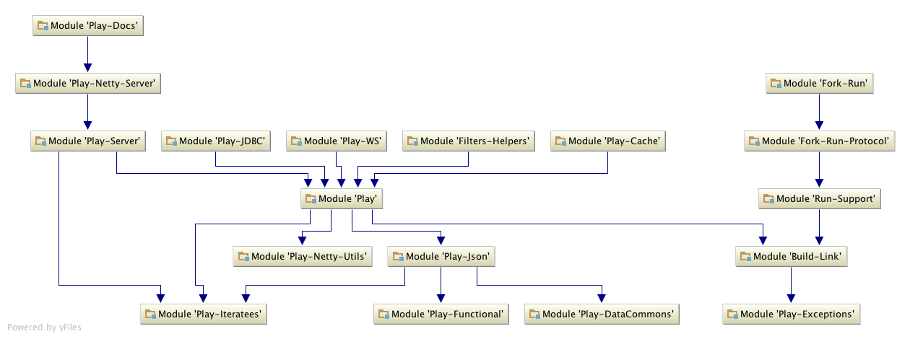
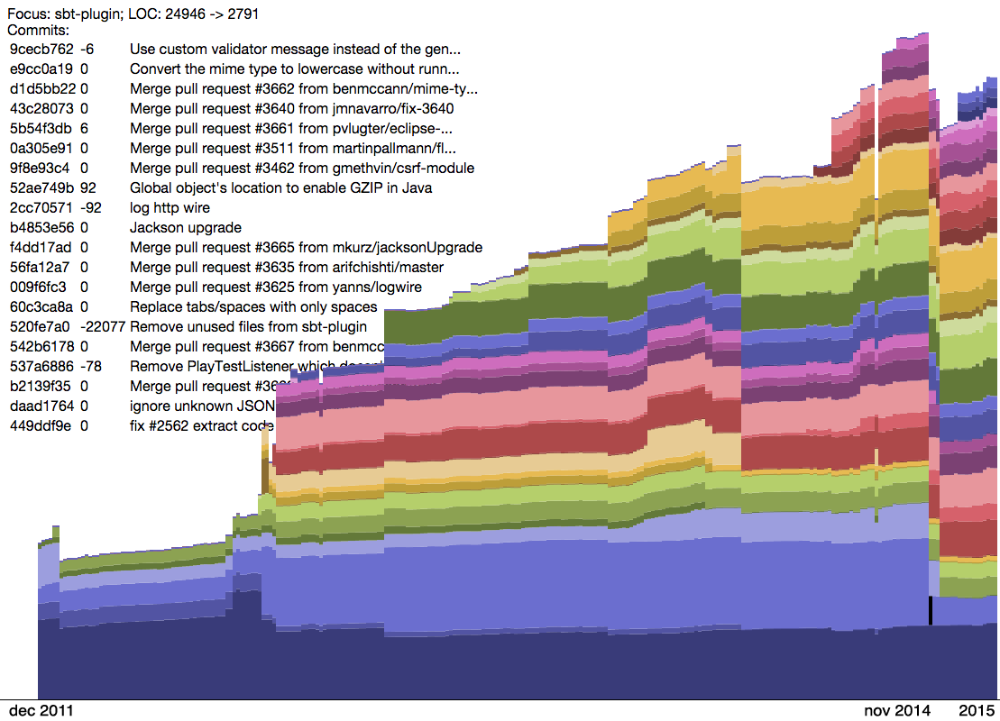
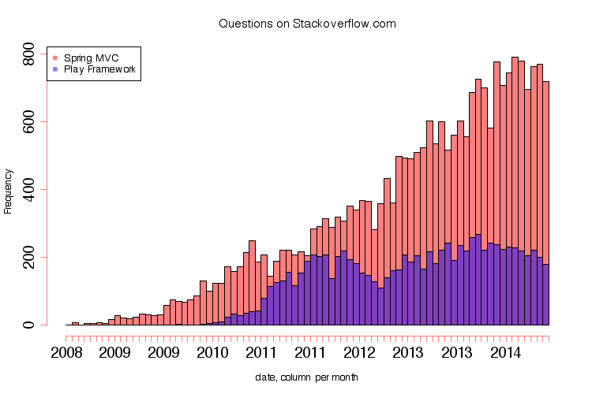
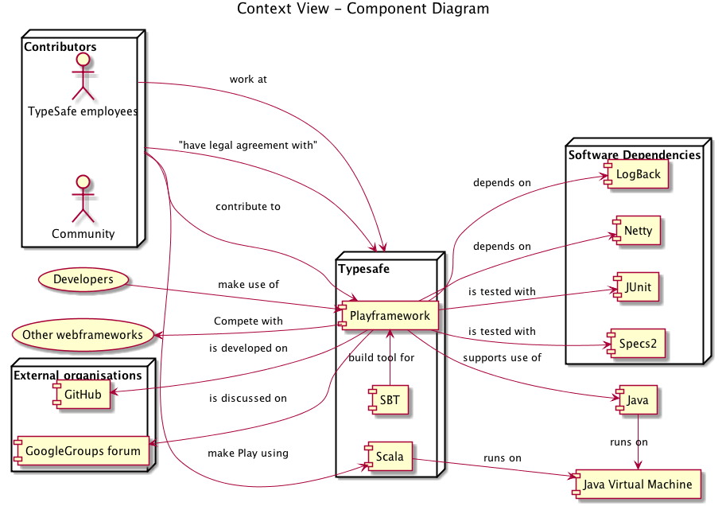
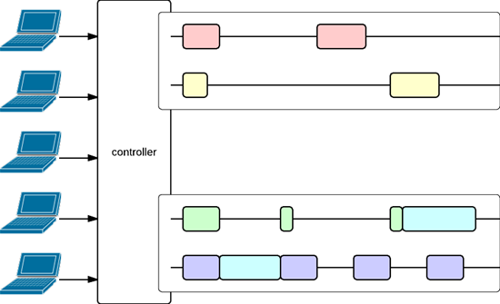

# Play Framework

###Abstract
This chapter describes and explains various views and perspectives of the Play Framework that together aim at providing a broad architectural overview of the system and its context. 
The stakeholder and context view show that there are a number of very prominent stakeholders involved in the project and that the framework itself does not have many dependencies. 
Play is in a transition to a more modular design that improves scalability and speed, while trying to maintain backwards compatibility. 
In the concurrency view it is explained that Play aims at evolving to a reactive and entirely stateless web applications framework and this is partly achieved by moving the execution of HTTP requests to an event driven system. 
Finally an overview of Play's past and future is provided from which can be concluded that these transitions are in line with proposed development roadmaps.

**Table of Contents**

- [Play Framework](#play-framework)
	- [What is Play?](#what-is-play)
	- [How to Play?](#how-to-play)
		- [Features](#features)
		- [Who is helping?](#who-is-helping)
		- [What is next for me?](#what-is-next-for-me)
	- [How to contribute?](#how-to-contribute)
		- [Workflow](#workflow)
		- [Who is merging?](#who-is-merging)
	- [Who is playing?](#who-is-playing)
		- [Context View](#context-view)
		- [Stakeholders](#stakeholders)
	- [Future[Play]](#futureplay)
		- [Reactive](#reactive)		
		- [Evolution Perspective](#evolution-perspective)
	- [Conclusion](#conclusion)

## What is Play?

You want to develop your next big web application? 
Or your team asked if they please could use Scala, or Play?
This chapter explains what the Play Framework is,
what it is made of, how you can use it, how you can contribute to it, and who else is involved.

[Play Framework](https://playframework.com/) is a web application framework for both Java and Scala.
Play provides you the tools to quickly and easily develop scalable, modern and fast web applications.
Web application frameworks come a 
[dime](https://github.com/showcases/web-application-frameworks) 
[a](http://en.wikipedia.org/wiki/Comparison_of_web_application_frameworks) 
[dozen](http://www.bestwebframeworks.com/).
On the other hand, only a few frameworks for [type safe](https://en.wikipedia.org/wiki/Type_safety) languages like Java and Scala exist.
Play allows you to implement your application in Scala or Java, or both if you prefer.
You can utilise the power of a powerful compiler with good support from a company and a large community.

From our experiences we found that Play should be your number one choice in a number of cases. 
First of all, you can step right in if your development team is used to Java or Scala.
Play offers your team the confidence that type safe languages bring.
It allows large teams to work together creating large, multi-modular applications, 
while ensuring compatibility of concurrent changes through type checking.
If your team wants to learn Scala, Play is the way to go: since it supports Java too,
you can easily convert later on, beginning your Scala journey with a small step.
When handling large amounts of streaming data Play has [got you covered](https://www.playframework.com/documentation/latest/Iteratees).
When building a real-time application (for example a chat app) Play [integrates](https://www.playframework.com/documentation/latest/ScalaAkka) nicely with [Akka](http://akka.io/)'s Actor system.

In the following chapter we will give some background to Play: features, architecture, how you can contribute, and the stakeholders that influence its development.

## How to Play?
The [documentation](https://playframework.com/documentation/latest) provides a good starting point when you want to create your first application.
But besides how to use Play, what features does it offer?
And how are these features realised?

### Features
Web application frameworks generally provide a HTTP server, request parsing utilities, a way to deliver responses, caches, database access layers, templating libraries, and 
localisation.
Play offers these things as well.

The features of Play are divided over several modules.
All HTTP features are located in the play-server and Netty modules for example.
View templating is brought out of the project, in the form of [Twirl](https://github.com/playframework/twirl).
Some features are not modularised live in the play-core module.
These include routing, MVC logic, form validation, localisation, and several utilities.



The diagram above shows most of the modules and their dependencies. 
The test modules and Java-specific modules are excluded to provide a clearer view, but can be found in the [full diagram](images/module-diagram/modules-full.png). 
Much of the functionality is contained in the main Play module, central in the diagram. 
This main module depends only on these high level modules, required for basic operation:

- [Play Iteratees](https://www.playframework.com/documentation/latest/Iteratees), contains monadic structures for generating and consuming lazy streams
- [Play JSON](https://www.playframework.com/documentation/latest/ScalaJson), contains JSON parsing and modification functionality
- Play Netty Utils, contains HTTP utilities (e.g. Cookie parsing)
- Build Link, contains Java interfaces to support building user code with different Scala versions than used for Play's build

The many other modules that extend a minimal Play application. 
For example:
[Caching](https://www.playframework.com/documentation/latest/ScalaCache), 
[JDBC Databases](https://www.playframework.com/documentation/latest/ScalaDatabase), 
different HTTP back-ends (Netty or [Akka](https://www.playframework.com/documentation/2.4.x/AkkaHttpServer)), 
[request filtering](https://www.playframework.com/documentation/latest/ScalaHttpFilters) (Gzip, CSRF), 
[WebServices](https://www.playframework.com/documentation/latest/ScalaWS) (contains tools for outbound connections, OAuth and OpenId).

Modularisation is important when building applications that scale.
Separate teams can work on their own module, bundling functionality and reducing coupling.
Also, application modules can be deployed separately, this allows teams to leverage horizontal scalability. 
Unused modules can be disabled, lowering resource usage. 
Furthermore Scala [compilation speeds are improved](https://www.playframework.com/documentation/latest/CompilationSpeed) when creating smaller modules, for several reasons, including the parallelisation and limiting the amount of compilation steps.

The developers of Play focussed a lot on modularising Play in the past and continue to do so today. 
To visualise this, the following [interactive graph](http://delftswa2014.github.io/team-playframework/modules.html) shows the size in LOC of each module as a different slice of the total code base. 
The overlaying text is dynamic and shows the commits in the currently hovered over changes.

[](http://delftswa2014.github.io/team-playframework/modules.html)

First of all we can see that lots of modules were added over time. 
Also existing modules disappeared, as was the case with Twirl and [Anorm](https://www.playframework.com/documentation/2.1.0/ScalaAnorm). 
The main trend is adding modules instead of extending existing modules, and sometimes modules are split into smaller sub-modules.
Altogether the developers have done a great job keeping modules small and focussed.

### Who's helping?
As any developer will know, the best tool for learning is looking up your questions on [StackOverflow](http://www.stackoverflow.com).
For well adopted frameworks, StackOverflow provides answers for almost all questions raised by programmers.

We found that there is a relative constant activity on StackOverflow regarding the Play Framework.
We compared the activity for Play to the activity for Spring MVC. 
Spring MVC is a Java web application framework on top of [Spring](http://nl.wikipedia.org/wiki/Spring_Framework), which exists since 2002.
Spring is a huge ecosystem, already at major version 4, so it is interesting to compare it to the much newer Play Framework.

The comparison is shown in the diagram below. 
The fact that Play has less questions could mean that Play is easier to use than Spring MVC, or that more people are using Spring. 
Both seem reasonable: Play is very well documented, and Spring MVC is widely adopted due to Spring, convincing people to use that whole platform.
Compared to their estimated sizes (see [jobs](#what-s-next-for-me) below) however, Play has relatively many questions.



Getting exact usage numbers is hard however, as Play does not advertise itself in response headers.
This causes sites like [BuiltWith.com](http://trends.builtwith.com/framework/Play-Framework) not to measure its world wide usage correctly. 
[This BuiltWith-profile](http://builtwith.com/ddb.tudelft.nl) for example does not list the (actual) usage of Play.

### What is next for me?
From the perspective of a developer using Play, 
it could be interesting to see if there are any work opportunities.
As in the previous section we compare this to the existing Spring MVC framework and other web frameworks. 

Our metric here, the amount of job openings, relates to the question of how adopted Play is.
The more jobs we found, the more adopted Play is.
We looked at the amount of jobs on [Indeed](http://indeed.com), for which each of the frameworks is listed.


From this we can see that there exist frameworks that are far more adopted by employers, concluded from the amount of job openings.
We think that this is due to the fact that traditionally PHP and JavaScript are the most common web languages,
and now that JavaScript is a back-end language too, it is becoming really huge, 
because so many people (think to) know it already.
The demand for Play developers is relatively low, but still considerable, even having surpassed the good-old ASP.NET.
Play operates in a niche (Scala) in a niche (JVM), for which demand is lower, 
but compared to Scalatra, it is scoring good in its niche. 

## How to contribute?
While many developers would only use Play for developing their own applications, there is also a possibility to contribute to Play.
The source code of the Play Framework is managed in the [GitHub](https://github.com/playframework/playframework) ecosystem. 
In this git project, [general rules](https://www.playframework.com/documentation/2.3.x/Guidelines) have to be observed, for instance one cannot commit directly to the 'master' branch.
Developers are discouraged to use particular code constructs, such as: Locks, casting or modifying the global state.
The [guidelines](https://github.com/playframework/playframework/blob/master/documentation/manual/hacking/Guidelines.md) specify where your code needs to go and what package name it should bear.
All contributed code needs to be correctly formatted using [Scalariform](https://github.com/mdr/scalariform).
By doing this the code style remains uniform throughout the project.

### Workflow
The general workflow of committing code is as follows:

0.  Make sure you have signed the [Typesafe CLA](www.typesafe.com/contribute/cla), if not, sign it online.
1.  An issue should be made on Github, explaining what you want to fix or implement, this helps to tell others in the project what you are working on.
2.  You write code locally, while observing the [standardisation guidelines](https://www.playframework.com/documentation/2.3.x/Guidelines#Pull-Request-Requirements). You commit to a local branch with a meaningful name.
3.  As a general rule, every piece of code that is added must be accompanied by test code.
Almost every PR we analysed (that provides contributions to major parts of Play) and that is merged, contained test code.
This way, the developers of Typesafe ensure that all added code has corresponding test code.
3.  The commit message should be an one line summary of what the commit is doing. The description should contain an enumerated list of what you have done.
4.  Before you make a pull request, commits should be squashed into a single commit, while observing the previous rule for the commit message.
5.  Finally you open a pull request to merge your commit into playframework/playframework master. 

For most people contributing to Play, the contributions should come from a fork of the original project.

<!-- How and when the source is automatically build. -->
### Continuous integration
Play utilises a [continuous integration](https://playframework2.ci.cloudbees.com/) service called [Jenkins](http://jenkins-ci.org/) hosted by [CloudBees](https://www.cloudbees.com/).
This service is configured to automatically build certain branches (such as 'master' or '2.3.x').
Also all pull requests will be automatically build, or can be rebuild by using a certain keyword in a github pull request comment ([`@play-pull-request-validator try again`](https://github.com/playframework/playframework/pull/4007#issuecomment-76663971)).
After the build all unit and integration tests are run and the result is reflected on Github, marking the pull request as ready to merge, or indicates whether the build or tests are failing.


<!-- How the binaries are released for testing and use. -->
### Releases
To obtain the Play framework binaries, you can use the  [Typesafe Activator](https://typesafe.com/community/core-tools/activator-and-sbt).
From the [website](https://playframework.com/download) the latest version of the  Activator can be downloaded, but it is also available via [brew install typesafe-activator](http://brew.sh/).
Activator helps to build and configure play projects.
For novice users Activator provides a nice web interface by running `activator ui`, some bare Scala and Java application templates and example projects are available from there.
Activator will download Play and other dependencies for a developer using [sbt](http://www.scala-sbt.org/), using Maven or Ivy repositories.
It is possible to use other [releases](https://playframework.com/download#older-versions) or  [snapshots](https://www.playframework.com/documentation/2.3.x/BuildingFromSource#Use-in-projects) by adjusting the sbt dependency, from a [Maven/Ivy repository](https://www.playframework.com/documentation/2.3.x/Repositories).


### Who is merging?
The merges of Pull Requests are handled by, what we define as, integrators.
The main integrator is [James Roper](https://github.com/jroper), and besides James also [Rich Dougherty](https://github.com/richdougherty) and [Peter Vlughter](https://github.com/pvlugter) acted in the role of integrator.
Of the [10 pull requests](https://github.com/delftswa2014/team-playframework/issues/8) we studied extensively, James merged 7 of the 8 pull requests that were merged.

We have been able to identify several concerns that the integrators looked into. 
First of all, the integrators focussed on improving the system, while keeping external interfaces [the same if possible](https://github.com/playframework/playframework/pull/3888#issuecomment-72795185). 
Secondly, the integrators looked to see if the contributor also added the corresponding documentation, when the code impacts external behaviour. 
When breaking changes would be merged, the integrators tried to formulate reasons why to introduce the change. 
Reasons that were considered satisfactory include constraining Play to the specifications of [HTTP](https://github.com/playframework/playframework/pull/3939) or [JSON](https://github.com/playframework/playframework/pull/3888) for example.
When introducing these changes, the integrators seem to want to have at least [one transitional release](https://docs.google.com/a/typesafe.com/document/d/11sVi1-REAIDFVHvwBrfRt1uXkBzROHQYgmcZNGJtDnA/pub), in which old and new API's co-exist, with the original version of the API being deprecated. 
This allows for a smoother transition to new API's.


## Who is playing?

When you choose which framework you use, you commit yourself to this framework. 
It is essential to know the background of the framework to make a good choice.
Having a context is essential to be able to do a good comparison.
Knowing which stakeholders are involved is important as it shows if other parties have confidence in the platform and if people are involved in the project.

### Stakeholders
The most important stakeholder is Typesafe Inc. Typesafe Inc. is the creator of the Play Framework. 
Apart from the Play Framework, it [leads development](http://typesafe.com/products/typesafe-reactive-platform) of open source projects like Scala, Akka and sbt.

Typesafe is a stakeholder that can be identified with multiple roles: it is a *Communicator*, a *Maintainer*, and as an *Assessor*, as Typesafe ensures that each pull request of Play is conform legal [regulation](http://www.typesafe.com/contribute/cla).

Other stakeholders can be identified. Together with their roles they are listed in the table below. For a detailed overview, we refer to [the Stakeholder Analysis](D1.md#stakeholders).

| Type | Entities |
|---|---|
| Developers | Construct and deploy the system. Most active developers are employees of Typesafe. <br>[@jroper](https://github.com/jroper), [@guillaumebort](https://github.com/guillaumebort), [@pk11](https://github.com/pk11), [@richdougherty](https://github.com/richdougherty) |
| Users | Users of the Play Framework are the type of stakeholder that make use of the system. These are companies that use Play to build their (often client-facing) web services: <br> [LinkedIn](https://www.linkedin.com), [Coursera](https://www.coursera.org), [Klout](https://klout.com/home), [The Guardian](http://www.theguardian.com/uk), [BBC](http://www.bbc.com), many others |
| Supporters | Cloud Platforms as a service (PaaS) that support the Play Framework for their users: <br> [Amazon Web Services (AWS)](http://aws.amazon.com/opsworks/), [Jelastic](http://jelastic.com), [Heroku](https://www.heroku.com), [Google App Engine (GAE)](https://cloud.google.com/appengine/docs) |
| Funders | The stakeholders that fund the development of a system. These are venture capitals that have funded Typesafe Inc.: <br> [Greylock Partners](http://www.greylock.com), [Shasta Ventures](http://www.shastaventures.com), [Juniper Networks](http://www.juniper.net/us/en/homepage-campaign.page) |

The figure below shows an overview of the stakeholders discussed in the table above, and also shows the relation of Typesafe's other projects with respect to Play. 
<a alt="Stakeholder Diagram" href="images/stakeholder_diagram.png"></a>


In the diagram below, the stakeholders' power with respect to their interest are shown in a [Power/Interest Grid](http://www.mindtools.com/pages/article/newPPM_07.htm). 
Stakeholders in the top right are the most important stakeholders of the system.


### Context View
The context that Play resides in is mainly dependent on the projects that are developed and maintained by Typesafe itself (sbt, Akka). 
Other dependencies include more general ones like testing frameworks [JUnit](http://junit.org/ and [Specs2](https://etorreborre.github.io/specs2/). 

Communication about the framework is done using two external organisations, [Google Groups](https://groups.google.com/forum/#!forum/play-framework) mailing list forum and [GitHub](https://github.com/playframework/playframework).
The latter mainly serves for development, however, issues and bugs are also reported here.

There exist a number of web frameworks which can be considered as competitors. The most relevant and popular Java/Scala based competitors are listed below.

 * [Spring MVC](https://spring.io/) (Java)
 * [Grails](https://grails.org/) (Java)
 * [Vaadin](https://vaadin.com/home) (Java)
 * [JSF](https://javaserverfaces.java.net/) (Java)
 * [Scalatra](http://www.scalatra.org/) (Scala)
 * [Lift](http://liftweb.net/) (Scala)

The diagram below explains context and the dependencies and relations between the discussed components. 


## Future[Play]
The Future[A] looks bright, is a bad inside joke.
But Play is indeed very capable in handling [Reactive](https://en.wikipedia.org/wiki/Reactive_programming) data streams and Futures, also known as Promises.
This section addresses what Play currently offers for Reactive web applications, 
and it provides a perspective on the planned evolution of Play in the future.

### Reactive
One of the exiting features of Play is its Reactive foundation. 
Play is part of Typesafe's Reactive Platform, as part of their view on the 
[Reactive Manifesto](http://www.reactivemanifesto.org/) 
[[blog](https://typesafe.com/blog/reactive-manifesto-20)]. 
The Manifesto is really about providing a coherent approach and vocabulary to the architecture of Reactive Systems. 
Touching the core of modern Software Architecture, it defines 4 main aspects: 
_"we need to build: Responsive, Resilient, Elastic, and Message Driven systems"_.


With Play, Typesafe addresses these aspects and makes it 
[simple](http://www.toptal.com/scala/scaling-play-to-thousands-of-concurrent-requests) 
to build Reactive Systems, by providing the right tools. 
Where concurrency previously was hard to get right, Play and Scala handle much of this for the developer.

#### Blocking I/O and heavy computation
When creating a web application you often find that you need to do I/O or heavy computation.
Traditionally programmers would block on this operation, and continue only when the I/O or computation was completed.
For handling multiple concurrent requests, each request would need its own thread, which are quite expensive.
When the maximum number of threads would be in use, no more requests could be handled.
To continue to be responsive, even under large loads, Play utilises an evented execution model. 
Thist allows the main HTTP *execution context* to handle new requests, even when lots of I/O requests are in progress.
The image below [by Julien Richard-Foy](https://www.packtpub.com/books/content/handling-long-running-requests-play) (major contributor of Play) illustrates this: 
the execution of code is interleaved, while the threaded model would block the entire thread.


Until this point, this section could have been about NodeJS or any other modern platform as well.
While basic I/O requires only some minor usage of Scala's Futures (or Promises) which can be then handed off to asynchronous actions, 
for more complex operations Play offers some tools that are unique, some to Scala, but some are really in Play itself.

For example, when we defer a heavy computation, we need to put it into a different execution context, 
or we would still run out of threads on the default execution context. We can do so using very little code in Play:

In `application.conf`:
```
my-context {
  fork-join-executor {
    parallelism-factor = 20.0
    parallelism-max = 200
  }
}
```
In `MyController.scala`:
```scala
implicit val myExecutionContext = Akka.system.dispatchers.lookup("my-context")
def index = Action.async {
  val futureInt = scala.concurrent.Future { intensiveComputation() }
  futureInt.map(i => Ok("Got result: " + i))
}
```

Julien Richard-Foy visualised this in the image below. 
The two white horizontal boxes represent the execution contexts with both two threads.
Using execution contexts, related work can be grouped, keeping the default context fast and responsive while still waiting for legacy blocking operations on other threads, in a transparent way.



However, in general, blocking operations should be prevented. 
It is better to divide the work into small tasks that can be executed individually.
At the core of Play lives the [very high level](https://john-millikin.com/articles/understanding-iteratees/) [Iteratee library](https://www.playframework.com/documentation/latest/Iteratees), which follows the 
[Consumer/Producer](http://en.wikipedia.org/wiki/Producer%E2%80%93consumer_problem) pattern. 
It is used to handle incoming requests as streams of 
[Byte](http://www.scala-lang.org/api/current/index.html#scala.Byte)'s, 
which finally get converted to a 
[Result](https://www.playframework.com/documentation/2.4.x/api/scala/index.html#play.api.mvc.Result), 
which gets served to the client. 
The Iteratee library is not limited to HTTP tasks however, it can iterate over and result into all types.
The library itself consists of three types, the Enumerator, producing data, 
the Enumeratee which transforms, maps or interleaves data,
and the Iteratee which consumes data, producing a final result:

`Enumerator (produce data) → Enumeratee (map data) → Iteratee (consume data)`

Each step of an Iteratee can represent a single chunk of computation, for example with the size of a network packet.
Using Iteratees, many different data pipelines can be made.
Take for example Gzip filters: 
only the current chunk of data needs to be kept in memory, as each chunk can be processed individually and can then be passed on.
It can also be used to process live data streams like the Twitter Firehose, 
like how [Klout](http://engineering.klout.com/2013/01/iteratees-in-big-data-at-klout/) is using Play for it Big Data on Social Network data. 
These streams can be long running, but the tasks themselves are small, this is ideal for an evented execution model.

Using this pattern Play can also handle thousands of concurrent long-running requests. This is for example shown in this small [chatting application](https://github.com/matthiasn/sse-chat/issues/10#issuecomment-42857305).
Having a single server handling these amounts of requests is certainly not trivial using a solely thread-based model.


#### Akka
Besides the Iteratees library, Play also integrates nicely with another product of Typesafe: Akka,
which is build for complete Message Driven applications. [Akka](http://akka.io/) is a subject on its own, 
but (very briefly summarised) it is ideal for multi-actor applications (like chat) and it allows for blocking operations
to be executed on backbone machines, essentially converting blocking I/O to non-blocking I/O.

#### Stateless
To increase Elasticity and ease Replication, Play aims to be stateless. 
The language Scala itself already aims for as little mutable state as possible, 
decreasing the amount of issues due to locking and synchronisation.
Play itself adds to this that HTTP Session data is not stored in server side state,
but is stored in the cookie, at the client side.
Authenticity is ensured by signing the Cookie with
a secret key only available to the server. 
This allows all of the load balanced instances to access the same Session data, 
removing otherwise required client-server pair coupling behind load balancers.
Another way state is reduced is actually by the Iteratees library as an Iterator encapsulates and protects its internal state: Iteratees are [Monads](https://en.wikipedia.org/wiki/Monad_(functional_programming)).

> Iteratee monad provides strict, safe, and functional I/O [[ref](https://www.playframework.com/documentation/2.2.x/api/scala/index.html#play.api.libs.iteratee.package)]

By providing as little state as possible as a framework, Play motivates developers to create fully
stateless applications. 
The only explicit state that currently exists is the _current:Application_ state which contains 
references to loaded plugins and class path resources.
The current application state is [to be fully removed](http://typesafe.com/blog/play-24---a-sneak-peek) eventually.


### Evolution Perspective
To assess whether Play is ready to evolve, we look at how evolution could affect Play 
and which risks and costs might apply. 
We also give some directions of what is on the [roadmap](https://docs.google.com/document/d/11sVi1-REAIDFVHvwBrfRt1uXkBzROHQYgmcZNGJtDnA/pub) currently.

#### Short history
On March 13, 2012 a completely rewritten 2.0 version of Play was released. 
While offering a far better API, being build from the ground up to be Reactive, 
and not relying on magically generated bytecode anymore, 
[people still complained](https://groups.google.com/forum/#!msg/play-framework/AcZs8GXNWUc/IanbqC-c-MkJ) about the incompatibility with Play 1.
Obviously, when creating a product you need to consider your current users. 
Play discovered however, along the way of making 1.0, 
that the current path was not the way to go for future Reactive applications.
To [quote](https://groups.google.com/d/msg/play-framework/AcZs8GXNWUc/PdWeScGaw-gJ) Guillaume Bort:

> We are building a framework for the future, not for the past. The
> choices we make today are important; if we want to have the best Web
> framework in 2 years, ready for real-time web applications, supporting
> many JVM languages, able to scale to ten of thousands of concurrent
> users, we have to start now.
> 
> Just don't expect us to release in 2012 a Web framework supporting
> only Java (and backward compatible with Java 1.4 because you need it),
> compatible with the Servlet 2.0 API (to be able to deploy your
> applications on your "enterprise servlet" container), allowing only an
> old school blocking model (allowing only basic CRUD and "dynamic" web
> application of the 200x) and integrating natively with Spring (because
> this is the new cool thing that will kill J2EE for sure).
> 
> If you are not an early adopter, or you have another focus now, I can
> understand it. No one force you to use this new version released only
> 2 weeks ago. Just keep using the previous Play version, waiting for
> the brand new one to become more mature. 

They choose to invest a lot at that time to prevent that Play would not evolve enough
to keep up which the fast changing requirements for modern web applications.

#### Containing Change
Since then, Play 2.0 has evolved and backwards compatibility or _upgradability_ has always
been a major concern.
Play has stabilised significantly and has modularised internal components.
As discussed in the [Features](#features) section many features are now modules - 
essentially practising _separation of concerns_ and _encapsulation_ - 
containing future changes into their logical place. 

<!-- SoC and Enc are explicitly mentioned in Rozansky -->

### Allow Variability
By practising the strategy for variability, the evolvability increases as well.
General approaches to variability include _making elements replaceable_, 
_parameterising operation with configuration_ and _breaking processes into steps_.

In Play a lot of effort has been put into not depending on specific libraries. 
Earlier we mentioned Anorm and Twirl, 
but also many different Data Access libraries are supported and documented. 
Even inside the core this has played a role: in Play 2.4 Netty can be [replaced with Akka](https://www.playframework.com/documentation/2.4.x/AkkaHttpServer), 
and the [Guice DI](https://playframework.com/documentation/2.4.x/ScalaDependencyInjection) can be replaced by [Spring](https://github.com/jroper/play-spring). 
Removing the strict dependency on specific libraries increases the evolvability 
as these libraries will be easier to upgrade when there is less strictly coupled integration.

Not only is Play itself extremely configurable at both compile and run-time,
it also allows for users' applications to utilise the same configuration structure. 
For this, a file format was introduced called HOCON, which aims to be better human readable than JSON,
but more importantly allows for `include` statements.
This eases evolution as independent
configuration parameters can be separated as well.

Breaking up complex processes into smaller steps helps to comprehend 
the functionality and improves evolvability if those steps make good sense.
For users of the framework, Play's Iteratees library is a very good tool. 

_Remember the following?_

`Enumerator (produce data) → Enumeratee (map data) → Iteratee (consume data)`

_This can be easily transformed into this:_

`Enumerator (produce data) → Enumeratee A → Enumeratee B → Iteratee (consume data)`

Another tool described in the [Reactive](#reactive) section is Akka, 
which allow for complex processes to be distributed over multiple different nodes,
possibly with different roles. 
Imagine for example an video service, which could first upload and store a video,
then transcode the file on a heavy rendering machine and finally notify all connected clients of the new video.
This kind of communication could be handled by Akka. 
If later another stabilisation phase has to be inserted, this can easily be done even more easily.

### Extensibility
Next to variability for internal components are extension points for external functionality.
Allowing for plugins to hook into your system prevents the need to add functionality that is not needed for all users,
keeping the code base small, easing evolution. 
External developers can create extensions or thin wrappers to other libraries so that the main developers can focus on the core functionality.

### Reliable Change
To support reliable change, good tools need to be in place. 
[[Rozanski et al](http://www.viewpoints-and-perspectives.info/home/perspectives/evolution/)]
For instance, tools for automated builds and testing, software configuration management and continuous integration.
In section [How to contribute](#how-to-contribute), 
we described the tools used for automated build and automated testing from a developer viewpoint.

For reliable change software configuration management is essential, in order to reproduce the development environment later on.
The software configuration is managed with sbt, which uses Ivy or Maven style software repositories.
For accessing Play itself, Typesafe provides a Maven2-style [repository](https://repo.typesafe.com/typesafe/releases/).

Play is a framework to be used to build software, therefore the continuous integration part of the software itself is relatively small.
The only part of Play that is continuously integrated is the documentation on [www.playframework.com](http://www.playframework.com), which is updated [every ten minutes](https://www.playframework.com/documentation/2.3.x/Translations#Deploying-documentation-to-playframework.com ), with the latest changes 
[from Github](https://github.com/playframework/playframework/tree/master/documentation).

### Risks
A risk for evolution of Play could be that any of its dependencies stops to be developed.
Luckily Play depends on only a few major libraries like Apache Commons 
and libraries developed at Typesafe, like Akka, sbt and (largely) the Scala language.
Because Play offers thin wrappers around some of the Apache Commons, Akka and sbt features, 
users of Play do not have to worry about incompatibilities, as upgrades of those libraries 
are mostly transparent to the users of the framework.

#### Scala versions
Incompatibilities with different Scala versions have [always been an issue](http://day-to-day-stuff.blogspot.nl/2013/04/fixing-code-and-binary.html). 
Luckily Play uses sbt to cross-compile across different Scala versions. 
Also because the build is defined in a structured way in sbt, 
this build can be reliably reproduced and made compatible with newer versions.
There is however the risk that Play might start using a new fancy language feature of Scala at some point, 
possibly limiting backwards compatibility.

#### Competition
For an open-source platform such as Play it always is important to attract enough users and developers to keep the framework alive and advancing.
Supporting a modern language (Scala) and a modern design philosophy ([Reactive](https://typesafe.com/blog/reactive-manifesto-20)), Play offers what one should expect from a web-framework that is future-proof. But the competition is fierce and Scala is not a very widely adopted language.
The ability of Play to support both Java and Scala should form the unique selling point that should keep this framework ahead of the competition.

#### Upgradability
To maintain the user base of the framework as it develops, it is important for the users to be able to install newer versions of the framework without too much trouble.
We have noted that Play has extensive documentation on migrating to newer versions in the form of [Migration Guides](https://www.playframework.com/documentation/2.3.x/Migration23).
This way Play can be more easily upgraded to newer versions.
We also see that on the [roadmap](https://docs.google.com/document/d/11sVi1-REAIDFVHvwBrfRt1uXkBzROHQYgmcZNGJtDnA/pub) there are measures taken to make sure the upgrade to the next major version (3.0) can occur as smoothly as possible by providing a binary and source compatible in-between version (2.5) that will warn the developers of any deprecated API use.
Now developers have an additional step in between that their application will still work on, and allows developers to move on to the next version, without completely breaking their applications.

## Conclusion
Play is a framework that is constantly evolving to ensure that their users can integrate the latest and state of the art software technology and methodologies into their web applications. 
Part of this evolution is to transform to a more modular design, reduce the module size, ensure scalability, reduce resource usage, and increase (compilation) speed. 
Play is an underdog in terms of job perspectives, compared to its competitors.
Nevertheless, there is still significant demand for Play (Scala) developers. 
The future of Play is a move towards even more "Reactiveness", consisting of reducing blocking I/O operations, and becoming entirely stateless. 
Besides that, extensibility is key. 
Allowing variability, upgradability, and maintaining backwards compatibility is crucial for Play to provide users with the latest technologies and maintain its arguably small but sophisticated and exiting user base.

[Herman, Michiel, Ruben, and Vincent](https://github.com/delftswa2014/team-playframework/blob/master/team.md)
