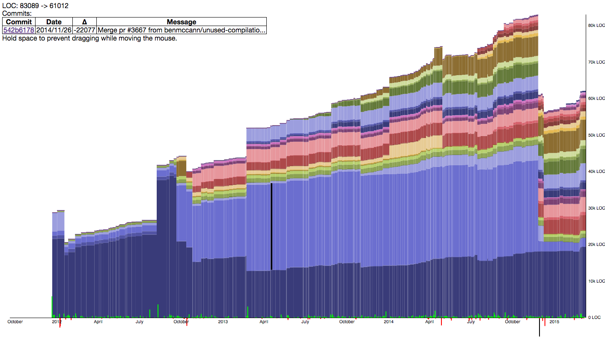

# How to view these metrics

Copy [this json file](https://github.com/hermanbanken/play-metrics/releases/download/metric-modules-output/metricscache.json) 
to the metrics folder of your copy of this repository. Then run:

````bash
npm install http-server -g
http-server # run inside the [metrics] folder
````
Now surf to [http://localhost:8080/chart.html](http://localhost:8080/chart.html) to view the graph.

You should see something like this:


# How to run these metrics

````bash
brew install cloc # or apt-get install on Ubuntu
cd extra/code/metrics #(where this README is too)
# Assuming you have sbt; The spaces around the word modules are intended:
sbt "run /absolute-path-to-play-source/ modules framework/src"
````

You computer will start indexing the LOC count. 
If you place 
[this json file](https://github.com/hermanbanken/play-metrics/releases/download/metric-modules-output/metricscache.bare-git.json) 
in the same directory as where you run the sbt command you will utilize that as a cache, 
which speeds things up tremendously.

# Fetching merge commits only

````bash
git log --merges --format="%H %ct %s" > merges.csv
````