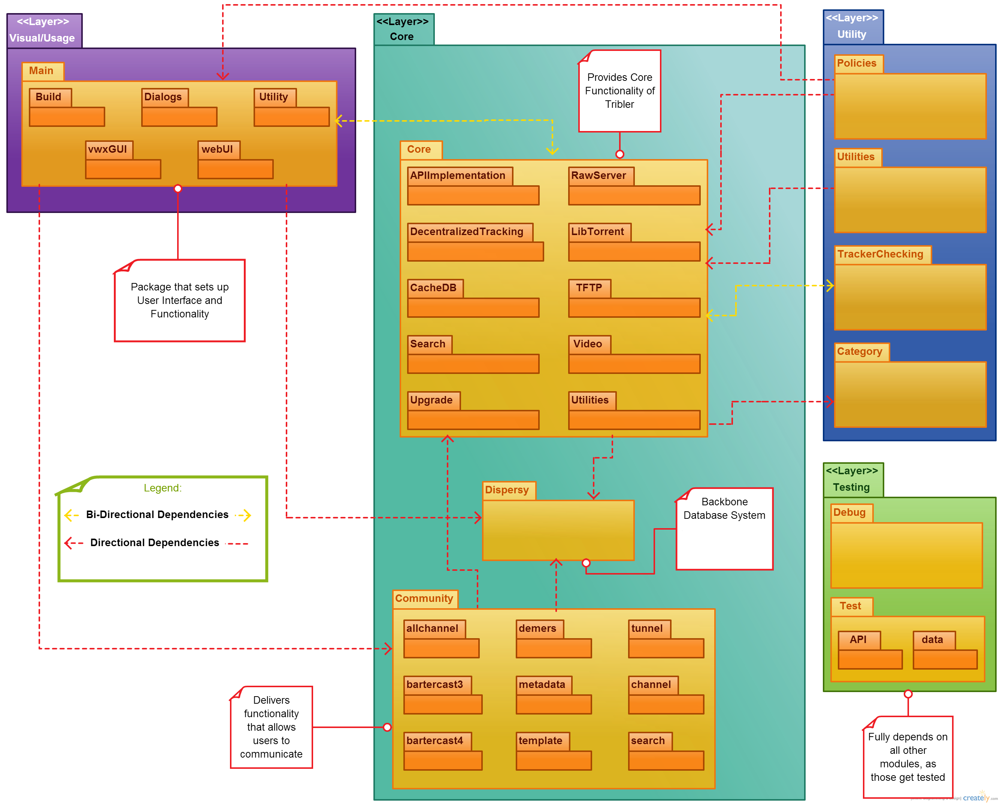
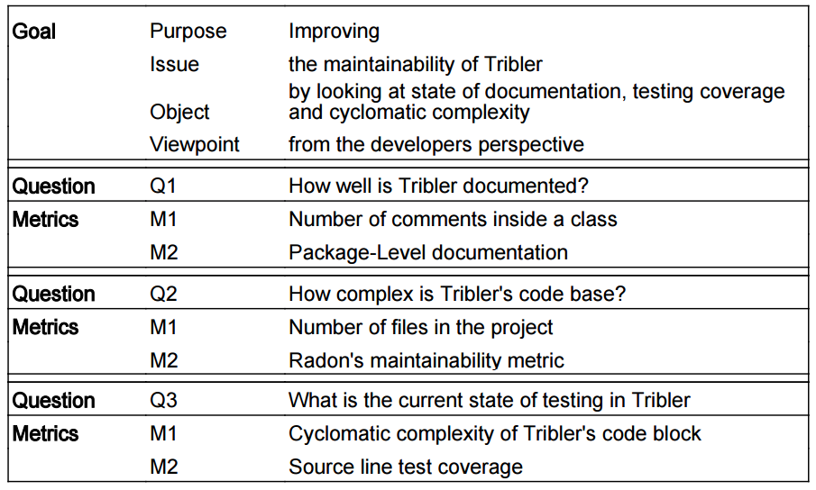

#Tribler: Aiming for Anonymity
**[Jeffrey Goderie](https://github.com/JeffGoderie), [Alex Simes](https://github.com/alex9311), [Brynjolfur Georggson](https://github.com/binnimar), [Peter van Buul](https://github.com/PetervB)**

####Abstract
[Tribler](https://www.tribler.org/) is a BitTorrent client that aims at providing anonymity for both seeders and leechers. It provides users with the option to download or stream torrents without needing a browser to find the torrents.

Tribler shows many design flaws that could be problematic to its maintainability. Due to the lack of documentation it is quite hard to get involved in the project from the outside.

In this analysis we provide a functional overview of Tribler for future developers, as well as design metrics that can help determine how maintainable Tribler is at any point in time.

####Table of Contents
- [Introduction to Tribler](#introduction-to-tribler)
- [Stakeholders](#stakeholders)
 - [Development-Crucial Stakeholders](#development-crucial-stakeholders)
 - [Improvement](#improvement)
- [Environmental issues and dependencies](#environmental-issues-and-dependencies)
 - [Context View](#context-view)
 - [Legal Issues](#legal-issues)
 - [Security Perspective](#security-perspective)
- [File Structure](#file-structure)
 - [Module Organization](#module-organization)
 - [File Dependency Matrix](#file-dependency-matrix)
 - [Common Processing and Standardization](#common-processing-and-standardization)
- [Maintainability](#maintainability)
  - [How well is Tribler documented?](#how-well-is-tribler-documented)
  - [How complex is Tribler's code base?](#how-complex-is-triblers-code-base)
  - [What is the current state of testing in Tribler?](#what-is-the-current-state-of-testing-in-tribler)
- [Inside the architect's mind](#inside-the-architects-mind)
- [Sources](#sources)

#Introduction to Tribler
Tribler is a BitTorrent client that aims for anonymity of both seeders and leechers. Tribler provides the same functionality as most BitTorrent clients, combined with the added functionality to directly stream torrents when desired. What goes on behind the scenes to make it anonymous is inspired by and adapted from the Tor Networking Protocol. Tribler's torrent database, managed by Dispersy, is filled with torrents found on the computers of all Tribler users.

Tribler also allows the users to use torrents found on the web. However, if the userun wants to stay anonymous, they should obtain the torrent file through Tribler's internal database system: Dispersy. Dispersy keeps track of torrent files that can be found across different Tribler users or communities (groups of users with similar interests). Having an internal database voids the need for browsers, which helps achieve the goal of anonymity.

[Tribler](http://en.wikipedia.org/wiki/Tribler) is being developed at Delft University of Technology, and was initialized by Johan Pouwelse in 2001. The project gained worldwide interest after an article published in 2012 describing its decentralized structure and the fact that it was virtually impossible to clear the torrent index. Tribler became anonymous in 2014, though with security flaws as discovered by some of the Tor developers (Issues [#1066](https://github.com/Tribler/tribler/issues/1066) and [#1055](https://github.com/Tribler/tribler/issues/1055)).

Tribler's mission is to: 
> Push the boundaries of self-organizing systems, robust reputation systems and craft collaborative systems with millions of active participants under continuous attack from spammers and other adversarial entities.

Academic software generally lacks the quality found in software developed at corporations. This usually proves to be fine, as academic software often serves as a prototype to show proof of concepts. However, Tribler is meant to be released and put to use, suggesting that a more maintainable and well-structured code base is desirable. Also Tribler is open source, so having a more maintainable code base also makes it easier for outside developers to assist in the project. This is why we decided to research the state of Tribler's code base and see what could be improved to make it more maintainable.

The results of this research will be provided below. Firstly, an overview of the most important stakeholders of the Tribler project will be given, followed by an overview of the relations between Tribler and its environments. Secondly, an overview of the structure of Tribler's code base will be provided. Thereafter, we will define and analyze metrics to determine to what extent Tribler is maintainable, and how maintainability can be improved, and lastly, we will run our findings by the project's architect.

#Stakeholders
On first sight, the people behind any software project seem to be the members of the development team. Upon further inspection, more people can be found that have some other sort of interest in the project, be it financial or functional. To gain insight into how software is being developed, and who pulls the strings, it is important to gain a proper insight into who these **stakeholders** are.

Stakeholders that can be found in Tribler's architecture are:
- Acquirers: People who oversee the procurement of the system or product.
- Assessors: Stakeholders that check whether requirements and standards are met.
- Developers: Team of people in charge of creating the actual software.
- Maintainers: Someone in charge of ensuring functionality and overseeing evolution of the project.
- Suppliers: Entity that provides any funds/material required for the project.
- Support Staff: Team that provides support to users.
- Testers: Stakeholders in charge of testing the software and future adaptions.
- Users: People that will use the project after it has been released.

While all types of stakeholders are of importance to Tribler, some are critical to the development of the project. These will be described in more detail in the following section. 

##Development-crucial stakeholders

#####Acquirers
Tribler has been in the hands of the TU Delft P2P group for the last nine years. The Tribler project leader is Johan Pouwelse, a professor at the TU Delft, who is also the main researcher of the Tribler project. The other project managers are Henk Sips and Dick Epema, both also professors at the TU Delft. These people can be considered acquirers of Tribler.

Tribler has received several million Euro's funding from the European union. Also, the Dutch technology foundation STW was providing additional funding for Tribler until mid 2009. Therefore the European Union and STW are also acquirer stakeholders of Tribler.

Without these acquirers the project would not have been initialized or continued, therefore they have a crucial part in any development project.

#####Assessors
In Tribler, the assessors would be the individuals who always look over the pull requests before they are merged. [Elric Milon](https://github.com/whirm), currently oversees and approves all pull requests, so he is Tribler's assessor. [Egbert Bouman](https://github.com/egbertbouman) also takes on this role sometimes.

#####Developers
The developers of Tribler consist mainly of academia from the TU Delft, in fact, till now only one outside developer has been involved.

Arno Bakker is the chief programmer of the project, according to the Tribler website. The full description of the Tribler team can be found [here](https://www.tribler.org/TriblerTeam/). 

In addition to looking at the team page on the tribler website, we also found the big developers the system by looking at the GitHub repository's top contributors. The top contributor is [Niels Zeilemaker](https://github.com/NielsZeilemaker), a PhD Student studying Parallel and Distributed Systems at the TU Delft. Since he started contributing to the repository in March 2013, he has made 1112 commits.

The next top contributor is [Lipu Fei](https://github.com/LipuFei), a Masters student at TU Delft. He has made 886 commits since he started contributing in November 2013.

While not actively contributing to Tribler, the Tor developers are also developer stakeholders. They have an interest in Tribler, as Tor and Tribler are related, so they can gain from Tribler's progress. On the other hand they also provide the Tribler developers with feedback and guidelines for their anonymity protocol.

#####Maintainers
Elric Milon does a lot of work in keeping the software up to date when tests start failing due to packages it relies on, this would make him the maintainer of Tribler, ensuring it's functionality throughout time.

#####Testers
While Rozanski and Woods claim that the testing stakeholders should be different from the development team, Tribler simply doesn't have enough people to meet this requirement. They do use Jenkins to run tests on deployments, who's results are looked at by several of the top contributors. Nevertheless, Tribler does not seem to have a separate stakeholder entity in charge of testing.

##Improvement
A communicator is a stakeholder that explains the system to the other stakeholders. In Tribler's case, this role is barely fulfilled. This could prove problematic if at any point the development team is completely replaced, or one of the investors wants a better insight in the project. It would therefore be wise for Tribler to invest in such a stakeholder, even if it is merely an improved documentation. Have a communicator could also help outside developers to contribute to Tribler.

#Environmental issues and dependencies
To gain understanding of any project, it is helpful to have an overview of how different influential entities in your project interact. One way to obtain such a view is by creating a context view. A context view shows the internal and external actors in a system, and to what extent they interact with each other. In Tribler's case another important environmental aspect is the legal side of the project. This will be discussed after the context view has been detailed.

##Context view
Tribler's main scope and responsibilities are:
- Providing users with a BitTorrent Client that can also stream video torrents
- Providing users with anonymity while downloading
- Omit the need for a browser

These elements should be pertinent in the developement of Tribler. Using this information, and the obtained insight of how development is being done, a context view can be created.

The context view shows the relationships, dependencies and interactions between the system and its environment.

###Important entities
An important entity is someone or something that is of vital importance to ensure that Tribler is functioning and meeting its responsibilities.

The main entities in Tribler's functionality are the user and ["Dispersy"](https://github.com/Tribler/dispersy). Dispersy is an elastic database system designed for P2P-like scenarios. The database obtains torrent-files from the user, and the user can select downloadable torrent-files from the database managed by Dispersy.

Dispersy was originally only a database system, but has been adapted to setup connections with peers as well. It discovers potential peers and tries to connect to them. If the peer happens to be behind a NAT protocol, Dispersy will attempt to puncture this and connect afterwards.

Being specifically for Tribler, it is hard to classify Dispersy. Being a completely separate project, it could be seen as an external entity. However, its niche 'user' base could classify it as an internal entity as well.

An important external entity ensuring Tribler's current functionality is the BitTorrent Streaming Protocol, which allows users to watch content without downloading, providing the Youtube-like service.

Being heavily inspired by Tor, Tribler closely follows progressions in the Tor project. If a vulnerability is discovered in the Tor Networking Protocol, it could mean that Tribler's anonymity protocol is compromised as well. While the developers of Tribler have made their own implementation of Tor's protocol, Tor is still of great importance to the project, and could therefore be classified as an important external entity.

While Tribler is already functional, it is still actively being developed, therefore the context view also contains many development-related entities. 

For development Tribler depends on 4 external entities: Python, Freenode, Jenkins and Github. Communication between developers, when not done in person, is done through FreeNode. The code base is being developed in Python, utilizing some of Python's libraries, and is managed on [GitHub](https://github.com/Tribler/tribler). Before pull-requests containing additions/adaptions to the code base, get accepted, these changes have to be tested, this is where Jenkins comes in.

Other than the external entities that Tribler depends heavily on for its development, main bodies of interest are the developers and the project leader, as they are putting it all together.

Tribler is a multi-platform program, build to run on Windows, Mac OS and Linux systems. Development on the other hand is only supported on Linux due to issues with libraries that are needed for development. 

##Security perspective
For Tribler, users' anonymity is very important. This importance is reflected in the Tribler system's implementation and utilization of security and cryptography measures over a distributed network. 
These requirements cause a need for developers that have a deep understanding of those measures and how best to implement them into a project like Tribler.

* From a functional viewpoint, the Tribler system needs to be able to enable peer-to-peer connection and data transfer over a onion routed network.
* From a users viewpoint, the users of the Tribler system should be able to search for downloadable content of their choosing while keeping their anonymity. The anonimity of the users should also be maintained when seeding.
* From a development viewpoint, the process should follow strict guidlines regarding implementations of security and cryptography measures.

##Legal issues
Tribler faces many of the same issues as regular BitTorrent clients: The BitTorrent-side of the software is perfectly legal, and people downloading torrents used to be well within most legislative restrictions, till the laws concerning downloading copyright-sensitive material for personal use got changed. Now both downloading and uploading torrents is illegal, at least when the torrent contains copyrighted material.

However, Tribler does also face legal aspects with regards to full anonymity. Anyone who uses Tribler can be used as a potential exit node. Even when not downloading anything with Tribler, one could potentially be violating their ISP protocol. This is an intended element of Tribler, as it provides users with plausible deniability. Similar legal issues can be seen related to the Tor Network Protocol.

#File Structure
As projects grow in size, they grow in complexity. This phenomena can lead people involved in the project to lose sight and overview of the project. A development view displays an overview of the structure of the project and its components as well as illustrates the important pieces which glue them together. A well maintained development view can help developers to maintain and extend the code base more efficiently.

## Module Organization
To gain a better understanding of how a system works, and how it can be maintained without breaking dependencies, a Module Structure Model (MSM) can be created. An MSM consists of one or more modules in which elements of the source code are placed. These modules might have inter-modular dependencies, which are displayed in the MSM.

Tribler's current structure advocates a modular division based upon functionality of modules. This leads to a 4-module division:

- Core module, contains the main functionality for Tribler, including its communication system and its database (Dispersy)

- Visual/Usage module, takes care of the user related aspects of Tribler, like setting up the UI, and the end-user functionality provided by the Core module

- Utility module, extends the functionality of Tribler through helper functions.

- Test module, allows for elements to be tested in Jenkins, also contains files to do testing on, and to debug code.

Each of these modules contain the packages that help provide the corresponding functionality. After adding these packages to the MSM, the inter-modular dependencies had to be investigated. While the intra-modular dependencies are generally equally important, these dependencies give no additional insight in how the different segments of functionality (modules) are dependent upon each other. A better insight in these intra-modular dependencies (imports) is given in the [File Dependency Matrix](#file-dependency-matrix) that we made for the Core package, which is the largest and one of the more complex packages in Tribler.

Taking the gained knowledge of the system and putting it into a usable model resulted in the following Module Structure Model:

The four high-level modules consists of the following folders:
* Core:
 * Core: The core of the project
 * [Dispersy](https://github.com/Tribler/dispersy): An elastic database system that handles torrent files, connections and penetration of NAT services
 * [Community](https://github.com/Tribler/tribler/wiki/Tribler-Development-Pointers#communities): Includes code for community tools for developers and users.
* Main:
 * Main: Initialization point of Tribler, holds the GUI code and the initialization of the end-user functionality
* Utilities:
 * Category: Includes code for categorizing torrents
 * Policies: Policies has setting related code like max download speed etc.
 * TrackerChecking: Includes source code for trackers and torrents, p2p connections
 * Utility: Includes utility functions for the project
* Test:
 * Debug: Debugging tools for Tribler 
 * Test: Includes testing scripts for the project

As can be seen in the Module Structure Model, there are some circular dependency violations (bi-directional dependencies), which is considered bad practice in software development. However, due to the prototype development stage that Tribler is in, less time and effort goes into the structure of Tribler, whereas more time seems to be spend on implementing new functions. This disregard for structure allows for high flexibility while developing, but it might negatively influence maintainability and security.

##File Dependency Matrix
Tribler's core functionality consists of many different files, each of which requires understanding of its functionality. To aid outside developers in contributing to the project, it would be beneficial to be able to provide them with an quick overview of how different files depend on each other. The Core package can be quite overwhelming at first, and some small changes can have a large impact, therefore an overview for that specific package (excluding nested projects) was created.

##Common Processing and Standardization
Having specific guidelines in a development process can be beneficial to the speed and ease of development, and if needed, maintenance. Consistency in the software architecture can also help outside developers in getting settled in a project.

###Standardization of Design
An element of software architecture that provides critical benefits to maintainability and ease of understanding is standardizing key aspects of design.

As stated before, academic software is meant to show proof of concept, and therefore standardization of design is not of critical importance. This importance shifts as a project becomes more than just a proof of concept and as more people start contributing to the project. If the project grows it becomes crucial to have consistency in file, folder and project structure.

This consistency can be found in naming, commenting, and file-content conventions. For Tribler, there is no standardization. File names do not reveal whether a class or function is being defined in the file, and file names are not always consistent with the classes present in the file. Other inconsistencies occur in how files are commented. Some files having comments for each function, whereas others have no comments at all. 

These inconsistencies occur due to the lack of development guidelines. The [development pointers](https://github.com/Tribler/tribler/wiki/Tribler-Development-Pointers) for new developers are outdated, and provide no guidelines on design. This adds to the belief that Tribler's management currently values functionality over maintainability and consistency. The lack of guidelines could, in the long run, have negative effects on maintainability and attracting new developers.

###Standardization of Testing
Rozanski and Woods state that standardization of testing, including technologies and conventions, helps in ensuring a consistent approach to testing and speeds up the testing process. In Tribler, there is no definite standarization, but any new feature has to come with its corresponding tests, and these have to pass for the new attribute in order to be accepted.

#Maintainability
Now that we have provided a better insight into the structure of Tribler's code base, we can move on to software metrics. We will define metrics to determine to the status of Tribler's maintainability, and how it can be improved. 

The idea behind these metrics is to make Tribler more maintainable. To do this we formulated three questions to provide us with insight in the current status. Each question has a set of metrics that are used to answer it. The table below provides a visual representation of the goal.

In the process of seeing how maintainable Tribler is, we will consider each of Tribler's packages separately. The packages we are identifying for this purpose are Category, Community, Core, Dispersy, Main, Policies, Test, and Utilities. 

###How well is Tribler documented?
For this question, we look at how many comments are in the python files of Tribler's source and at how much documentation there is explaining the purpose and structure of each package.

#####Comment Density
We define "comment density" as the ratio between comment lines and source code lines. Below, we display both the average and median percentages of code that is comments separated by package. 

| Package | Median comment density | Average comment density |
|-------------|---------|---------|
| Category    | **4%**  |  **11%**|
| Community   | **5%**  |  **9%** | 
| Core        | **23%** |  **22%**|
| Dispersy    | **16%** | **24%** | 
| Main        | **6%**  | **5%**  |
| Policies    | **23%** | **19%** | 
| Test        | **5%**  |  **8%** | 
| Utilities   | **21%** | **16%** |
| All Packages| **11%** | **14%** |

Overall, we can see that there are a few packages that stand out as being poorly commented. Name, the Main, Community and Test packages have the three lowest median (and average) comment densities. Later on, we will see if this combines with any other metrics to make a particularly hard to maintain package.

#####Package Level Documentation
To determine the extent of Tribler's documentation on package-level, we went over all the packages and looked for files that explained what the package is supposed to do, and what it's key elements are. We believe this to be an important element to maintainability as it could help point developers in the right direction when adding/changing functionality.

Not considering information coming from source files (they were included in the comment section), we were unable to find any file or documentation of sorts that met the aforementioned definition. Therefore we would currently say that the package level documentation is at zero, making this more of an indication rather than a metric at this point.

#####Bringing the Two Documentation Metrics Together
While the second metric was merely useful in identifying what is missing in Tribler, the first metric does bring valuable insight into the system. We will be able to use this information in combination with the next metrics to help us diagnose what can be improved to achieve our goal.

###How complex is Tribler's code base?
To answer this question, we considered two metrics. First we looked into the number of files and lines of code in each package of the project. Then we looked at the maintainability score of each package using a great code-analysis tool we found. 

#####Number of Files and Number of Lines of Code
The Tribler project contains 477 Python files and 107,915 lines of Python code. Note that these numbers will vary slightly day to day due to the frequency of commits. Below, we have a table showing these metrics separated by package.

| Package 	| Number of Python Files 	| Lines of Python Code 	|
|-----------	|-----				|------			|
| Category 	| 4 				| 392 			|
| Community 	| 61  				| 11,519 		|
| Core 		| 223  				| 38,389 		|
| Dispersy	| 94 				| 22,648 		|
| Main 		| 5				| 29,642 		|
| Policies 	| 3				| 607 			|
| Test 		| 29 				| 4,295 		|
| Utilities 	| 4 				| 423 			|
| All packages 	| 477 				| 107,915 		|

The reason we consider the file count on the package level is that it will allow us to get an idea of what the more complex packages are in the system. We can see here that the Core package is definitely an outlier in this dataset. This could be an indicator that it is one of the more complex packages of our set in Tribler.

While 115k lines of code is not very large for a source code project, we need to consider the context. There are not very many active developers on this project, compared to software companies' development teams. As with the file count, we can use this metric to find the packages that are outliers in the system. The Core, Dispersy, and Main package have considerably more lines than the rest of the packages.

#####Radon's Maintainability Metric
Measuring complexity is known to be a very difficult task in software engineering. Above, we tried to use simple metrics to find which packages in Tribler are the most complex and, thus, the most difficult to maintain. Following the thought that complex systems are difficult to maintain, we argue that, in our context of complexity, systems deemed difficult to maintain are also complex. 

We used a Python library, [Radon](https://pypi.python.org/pypi/radon), to measure the "maintainability", which is directly related to complexity of the Tribler project. Radon has a function that gives a maintainability score for individual Python files. This score is computed by combining [multiple measurements](http://radon.readthedocs.org/en/latest/intro.html#maintainability-index). This combination of measurements gives an indication on how complex the code is. 

These maintainability scores are rated using the following scale:

| MI score | Rank | Maintainability |
|----------|:----:|:---------------:|
| 100 - 20 | A | Very high |
| 19 - 10	| B | Medium |
| 9 - 0	| C	| Extremely low |

In the figure below, we present all of the files that have received a B grade or worse according to Radon's maintainability formula. 

Only 20 files have rank C, and 4 files have rank B. Comparing this to the total of 477 python files in the project shows that most files are not complex. We can see that a lot of the complex files are found inside the Main package, specifically the vwxGUI sub-package. The Dispersy, Core, and Community packages also have some particularly hard to maintain (complex) files.

#####Bringing the Three Complexity Metrics Together
We have looked at two different metrics in an effort to describe how complex Tribler is. According to the Radon Maintainability index, Main is the most complex package. If we look at Main in the other two metrics, we see that it has the second most lines of code yet has an average number of files. This might suggest that more lines per file can quickly make a package more complex. To investigate this further, we created a table that shows the average number of lines per file in each package

| Package | Average Lines per Python File | Median Lines per Python File|
|-----------|-----|----|
| Category | 98 | 82 |
| Community |189  | 82 |
| Core |172  | 92 |
| Dispersy| 240 | 93 |
| Main | 502 | 179 |
| Policies |202| 189 |
| Test | 148 | 94 |
| Utilities | 106 | 94 |
| all packages | 226 |105 |

If we look at this chart with the idea that lines of code per file makes a system complex, the Main package would be most complex. This does agree with the findings of the Radon Maintainability index tool, which found the most hard-to-maintain files in the Main package. 

Other red flags raised by the first two metrics are the Core, Dispersy, and Community packages. All of these packages have relatively large amounts of files and lines of code. This insight into complexity can be combined with the results on documentation to determine where more documentation is needed.

###What is the current state of testing in Tribler?
#####Cyclomatic complexity of Tribler's code blocks
It is important to grasp how difficult Tribler is to test. To do this, we will look at the cyclomatic complexity, otherwise known as the McCabe number. The McCabe number gives a good indication of how many different paths there are through the code. If branch test coverage is desired, the cyclomatic complexity of a code base is equal to the number of test cases needed to achieve complete coverage. If path coverage is desired, the cyclomatic complexity is the minimum number of test cases needed to achieve complete coverage.

Let's take a look at the overall cyclomatic complexity of Tribler. Using Radon, we were able to inspect the McCabe’s number, i.e. cyclomatic complexity, of the Tribler code base. The tool differentiates between blocks of functions, methods and classes. In the image below, we have created a histogram showing how many sections have which CC score. A CC score is a grouping of cyclomatic complexity values. In our graph, scores are as follows:

| Score                       | A   | B    | C     | D     | E     | F   |
|-----------------------------|-----|------|-------|-------|-------|-----|
| **Cyclomatic Complexity Range** | 1-5 | 6-10 | 11-20 | 21-30 | 31-40 | 41+ |

In the chart below, we have created a histogram showing the CC score distribution in the Tribler code base. We used a logarithmic scale because of the large difference in values across the groups. 

As can be seen in the graph, many sections have a good cyclomatic complexity score. However, there are still a considerable number of blocks (51) that score a D or worse. In the figure below, we take a closer look at the code blocks that score a D or worse. In the figure, the block type is indicated by the capital letter on the leftmost end of the line (M for method, C for class, and F for function). The Cyclomatic Complexity score is on the rightmost side of the line, with the same range-to-score relation we describe in the table above.

From this we can see that the Dispersy and Main/vwxGUI packages of Tribler have some difficult-to-test sections. The vwxGUI package alone has 9 blocks of code that have very high cyclomatic complexity scores and the Dispersy package has 21. Now that we have insight in how many different tests are needed, we look into current test coverage.

#####Source line test coverage
In order to get information about test coverage in Tribler, we looked at the Jenkins test report from the latest [build](http://jenkins.tribler.org/job/Test_tribler_devel/930/cobertura/_default_/). Jenkins gives the source line test coverage for each file. To suit our earlier metrics better, we converted these into percentages per package. 

| Package | Avg Source Line Coverage | Median Source Line Coverage |
|-----------|:---:|:------:|
| Category | 93% | 93% |
| Community | 63% | 68% |
| Core | 76% | 80% |
| Dispersy | 78% | 81% |
| Main | 68% | 69% |
| Policies | 66% | 68% |

From this we can see that the test coverage is decent for Tribler as a whole, but concerning the complexity and importance of what goes on behind the scenes (e.g. anonimity) this could still be considered insufficient. Though Dispersy had a high cyclomatic complexity, it is still one of the most covered packages. This goes against one's expectations, but it could be explained by Dispersy being a stand-alone project (which is less actively being developed).

#####Bringing the Two Testing Metrics Together
Sometimes there is a direct relation between the McCabe's number and the difficulty to obtain complete tests. This holds true for the Main package; the vwxGUI sub-package has a high cyclomatic complexity and it has a low test coverage. The Dispersy package on the other hand scores quite bad on the McCabe's number as well, but its test coverage is amongst the highest in the project.

###Bringing findings from all questions together
Now we can combine what we learned and draw conclusions on the maintainability. Based on the outcome of the 3 questions, Main, Dispersy and Core need to be worked on to make them more maintainable. While the functionality is fixed, and therefore the McCabe's number is fixed as well, the documentation on these packages needs a lot of work to make them more easily understandable. All in all most of Tribler's source code is not overly complex when addressed separately, however, when getting into the project for the first time, the lack of documentation is quite a hurdle.

#Inside the architect's mind
To verify Tribler's current architecture with what we found, we consulted Johan Pouwelse. When confronted about the functionality over maintainability he replied:

> We are currently focusing on meeting the Minimal Viable Product (MVP). If this MVP has been reached, we will focus on making Tribler more maintainable. For now we try to create a Darknet, and beat scalability issues.

This verified the conclusion we had drawn from the software's architecture.

#Sources

###Websites:

* [tribler.org](tribler.org)
* [http://en.wikipedia.org/wiki/Tribler](http://en.wikipedia.org/wiki/Tribler)
* [https://github.com/Tribler/tribler](https://github.com/Tribler/tribler)
* [https://github.com/Tribler/tribler/wiki](https://github.com/Tribler/tribler/wiki)
* [https://github.com/Tribler/dispersy](https://github.com/Tribler/dispersy)

###Books:
* [Nick Rozanski and Eoin Woods](http://www.viewpoints-and-perspectives.info/). Software Systems Architecture: Working with Stakeholders Using Viewpoints and Perspectives.

